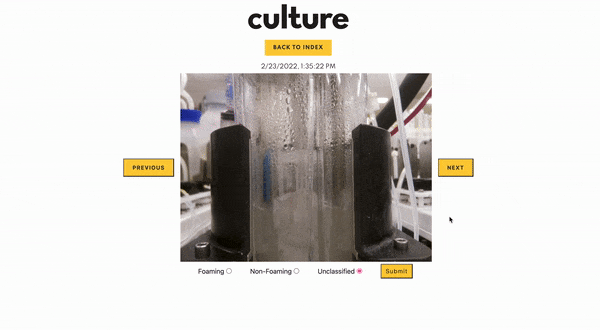
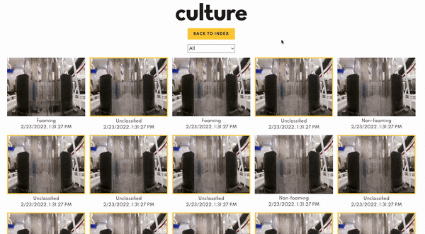
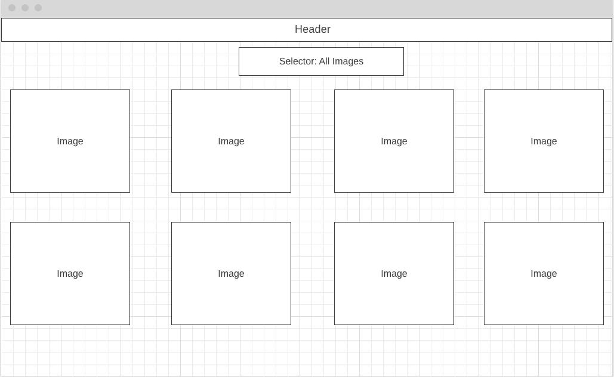
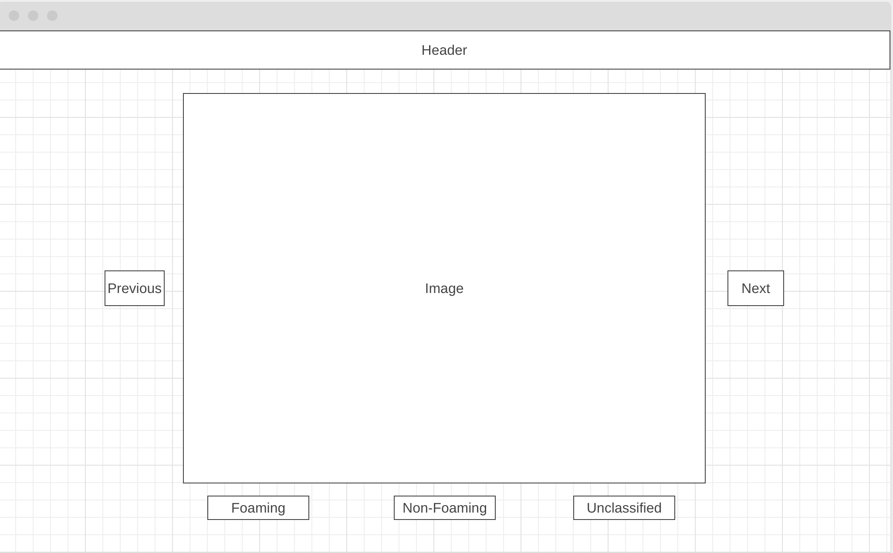

# SWE Foam Take Home Challenge - Michelle Huang

Video Showcasing Project Functionality: [Click Here!](https://www.loom.com/share/255024f249064560b751205cc3cefe91)

Built with React on the frontend and Ruby on Rails on the backend, this project allows users to view all images, mark individual images as foaming, non-foaming, or unclassified, and filter images depending on whether they are foaming, non-foaming, or unclassified. 

To improve user experience, results are paginated so only 100 images are displayed on each page. In addition, while users are viewing individual images, they are able to use their left and right arrow key to view the next or previous image. Lastly, to ensure efficiency and productivity, unclassified images are distinctly marked with a yellow border to draw greater attention to them.

## Run the Project
* npm install
* bundle install
* npm start
* rails s 

Once all commands are run, open localhost to view the project!
## Technologies
* Ruby on Rails
* React / Redux
* PostgreSQL
* JavaScript / AJAX / JBuilder
* HTML5 / CSS

## Features
* ### View Images from the Reactor Run

* ### Mark Images as Foaming, Non-Foaming, or Unclassified (Have Marks Persist)

* ### Filter by Foaming, Non-Foaming, and Unclassified

* ### Pagination
To integrate pagination, I chose to 
* ### Keyboard Shortcuts

## Wireframes
* ### Index Page

* ### Show Page
